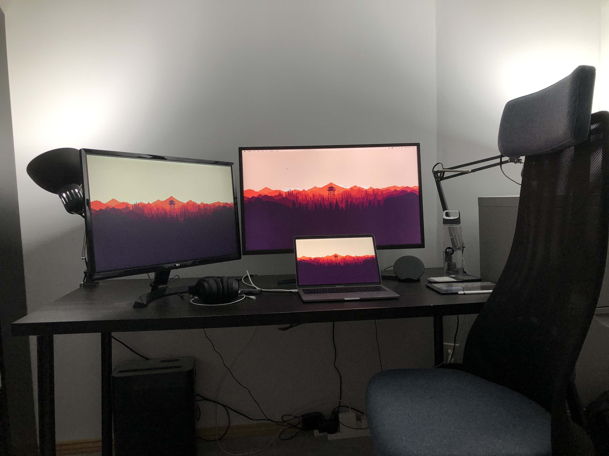

### Desk

I currently use a 75cm Ikea LINNMON table top+legs and two TERTIAL desk lamps with 1200 lumen 5000K bulbs that are pretty bright and simulate daylight pretty well, which is especially helpful during the winter. I sit on an Ikea JÄRVFJÄLLET chair, which I'd really recommend for anyone who doesn't want to go for a herman miller but still wants something that's comfortable to sit on for _many, many_ hours at a time.

I use the 13" 2019 macbook pro along with a 32" 4K monitor and a 27" 1080p monitor. I used to use the 27" one full time until I got the second monitor so I now just keep this one off to the side to hold extra tabs/arxiv papers/discord. I use an ipad with the apple pencil for any university assignments that are more conveniently done by hand instead of in LaTeX, and I still use my original iphone x with force touch.

I have a pair of noise cancelling headphones as well as a pair of wireless earbuds that I occasionally use on the go. I use a wireless charger for my phone and a usb-c hub with pass through charging for connecting my laptop to my monitors and charging everything though a single cable.

Here's a picture of everything on my desk (ignore the mess of chargers):

### Apps

At the moment, I'm using Firefox as my primary web browser, Vscode as my main editor, and [iterm2](https://iterm2.com/) as my preferred terminal emulator. I use the [Pocket](https://getpocket.com/) app on my laptop and phone to save any interesting articles and papers to read through later, and [Feedly](https://feedly.com/) for keeping up with all the blogs that I follow. I mostly use Discord to keep in touch with friends (find me @bilal2vec#8916), and Figma to mockup designs and make memes occasionally.

### Vscode

I mostly use these extensions:

-   [Github dark theme](https://marketplace.visualstudio.com/items?itemName=GitHub.github-vscode-theme)
-   [Discord presence](https://marketplace.visualstudio.com/items?itemName=icrawl.discord-vscode)
-   [Latex Workshop](https://marketplace.visualstudio.com/items?itemName=James-Yu.latex-workshop)
-   [Prettier code formatting](https://marketplace.visualstudio.com/items?itemName=esbenp.prettier-vscode)
-   [Pylance python language server](https://marketplace.visualstudio.com/items?itemName=ms-python.vscode-pylance)
-   [Settings Sync](https://marketplace.visualstudio.com/items?itemName=Shan.code-settings-sync)
-   [GitLens](https://marketplace.visualstudio.com/items?itemName=eamodio.gitlens)

### Dev

I use zsh as my default shell with the [Oh My Zsh](https://github.com/ohmyzsh/ohmyzsh) theme manager and the [zsh-autosuggestions](https://github.com/zsh-users/zsh-autosuggestions) plugin. I use [starship.rs](https://starship.rs) as my shell prompt.

I've installed and use nightly Rust, the latest version of Node through nvm, Python 3.9 through miniconda, and Latex through MacTex and homebrew. I also recently set up a nice neovim [configuration](https://github.com/bilal2vec/dotfiles) with almost all the features that I would have had through vscode, which is nice when I just want to edit something in the terminal or when I'm working on a remote machine through ssh. I use CoC for autocompletion with the following language server plugins: `coc-tsserver coc-json coc-html coc-css coc-clangd coc-rust-analyzer coc-latex coc-python`.

You can see most of the configuration files I use to customize my experience and install most of my dev tools [here](https://github.com/bilal2vec/dotfiles).

### Misc

I've remaped my caps-lock key to `esc` since my mac doesn't have a physical escape key and the top left side of my keyboard is a pretty awkward place to reach. I use the JetBrains mono font to make use of ligatures when coding, and I've [configured](https://apple.stackexchange.com/questions/259093/can-touch-id-for-the-mac-touch-bar-authenticate-sudo-users-and-admin-privileges/306324#306324) my terminal to let me authenticate commands like `sudo` that need me to type in my password with touchid. I use a 4k version of the firewatch wallpaper on all my devices.

